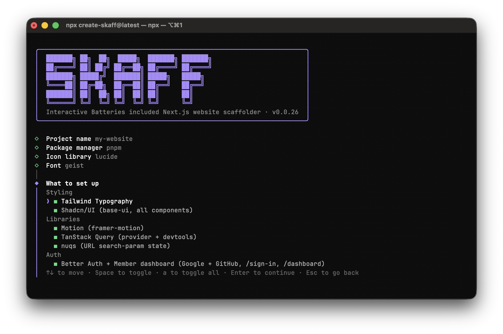

# Skaff

**Start a new Next.js app with the boring setup already done.**

Run one command, answer a few questions, and get a ready-to-build project: styling, UI components, linting, error pages, sign-in, and AI coding assistant setup — all installed and connected for you.

```sh
npx create-skaff@latest
pnpm dlx create-skaff@latest
bunx create-skaff@latest
```

Then:

```sh
npm run dev
pnpm run dev
bun run dev
```

---

## Why use it?

Setting up a new Next.js project usually means an hour of installing packages, copying config files, and wiring things together before you write any real code. Skaff does that part for you, the same way every time, so you can start on your actual app.

## What you get

**In every project:**

- **[Next.js](https://nextjs.org) + [TypeScript](https://www.typescriptlang.org)** — via [`create-next-app@latest`](https://nextjs.org/docs/app/api-reference/cli/create-next-app): App Router, no `src/` folder, `@/*` import alias
- **[Tailwind CSS v4](https://tailwindcss.com)** — with extra `@theme` tokens for breakpoints, container widths, and a text scale
- **Ready-made pages** — root layout with your chosen [Google font](https://fonts.google.com), a landing page, and `not-found`, `forbidden`, `unauthorized`, `error` and `global-error` pages built on shared `ErrorPage` and `SectionContainer` components; `lib/site.ts` for site metadata
- **Linting and formatting** — [Ultracite](https://ultracite.ai) ([Oxlint](https://oxc.rs/docs/guide/usage/linter) + [Oxfmt](https://oxc.rs/docs/guide/usage/formatter)) with the `anti-slop` plugin, React and Next.js rules, `.vscode/settings.json`, and a `typecheck` script
- **AI assistant setup** — `AGENTS.md` with coding rules, `CLAUDE.md` pointing to it, `.claude/settings.json`, and [Claude Code](https://www.claude.com/product/claude-code) and [Codex](https://developers.openai.com/codex) skills from [`vercel-labs/next.js-experimental`](https://github.com/vercel-labs/next.js-experimental), [`vercel-labs/agent-skills`](https://github.com/vercel-labs/agent-skills) and [`vercel-labs/agent-browser`](https://github.com/vercel-labs/agent-browser)
- **[agent-browser](https://agent-browser.dev)** — installed with its browser downloaded, so AI agents can test your app in a real browser
- **A README for your new app** — explaining what's inside and how to run it

**Optional extras** (all turned on by default, switch off what you don't need):

| Extra | What it's for | What gets installed and configured |
| --- | --- | --- |
| [shadcn/ui](https://ui.shadcn.com) | A full set of UI components (buttons, dialogs, forms…) plus light/dark mode | `shadcn init` with your preset, icons and font; every component added; aliases set to `lib/utils/cn` and `lib/hooks`; [`next-themes`](https://github.com/pacocoursey/next-themes); the shadcn lint plugin and agent skill |
| [Better Auth](https://better-auth.com) | Sign in with Google or GitHub, with a protected dashboard page | `better-auth` with SQLite, `/sign-in` and `/dashboard` routes, a `proxy.ts` route guard, sign-in/sign-out components, `.env.local` keys, and `auth migrate` run for you |
| [TanStack Query](https://tanstack.com/query) | Fetching and caching data from APIs | `@tanstack/react-query` + devtools, with a provider in the layout |
| [Motion](https://motion.dev) | Animations | `motion` |
| [nuqs](https://nuqs.dev) | Keeping things like filters and tabs in the page URL | `nuqs`, plus an `AGENTS.md` rule that URL state goes through it |
| [Tailwind Typography](https://github.com/tailwindlabs/tailwindcss-typography) | Nice default styling for blog posts and long text | `@tailwindcss/typography`, registered in `app/globals.css` |

## Try sign-in without any setup

If you turn on Better Auth, sign-in works straight away with **test Google and GitHub accounts**. You don't need to create any OAuth apps just to try it out.

When you're ready for real sign-in:

1. Open `.env.local` and remove `AUTH_EMULATE=true`
2. Add your keys: `GOOGLE_CLIENT_ID`, `GOOGLE_CLIENT_SECRET`, `GITHUB_CLIENT_ID`, `GITHUB_CLIENT_SECRET`
3. Set the callback URL in each provider to `http://localhost:3000/api/auth/callback/google` (or `/github`)

## What the setup asks you

You'll pick:

- **Project name** — or `.` to use the current folder
- **Package manager** — [npm](https://www.npmjs.com), [pnpm](https://pnpm.io), or [bun](https://bun.sh)
- **Icons** — [Lucide](https://lucide.dev) or [Hugeicons](https://hugeicons.com)
- **Font** — [Geist](https://vercel.com/font), [Inter](https://fonts.google.com/specimen/Inter), [Roboto](https://fonts.google.com/specimen/Roboto), and more
- **Extras** — from the table above
- **Component style** — a shadcn/ui preset: Maia, Nova, Vega, Lyra, Mira, Luma, Sera, or Rhea (only if you chose shadcn/ui)

Press **Enter** to confirm and **Esc** to go back.

## More ways to run it

```sh
npx create-skaff@latest            # asks for a project name
npx create-skaff@latest my-app     # uses "my-app" as the name
npx create-skaff@latest .          # sets up in the current folder
npx create-skaff@latest --dry-run  # preview what would happen, without changing anything
```

## Requirements

- [Node.js](https://nodejs.org) 26.4 or newer
- macOS, Linux, or Windows

## Project structure

What a generated project looks like with every extra turned on. Entries marked in brackets only appear when that extra is selected.

```
my-app/
├── app/
│   ├── layout.tsx                          root layout: font, metadata, providers
│   ├── globals.css                         Tailwind import and @theme tokens
│   ├── not-found.tsx                       404
│   ├── error.tsx                           route error boundary with retry
│   ├── global-error.tsx                    root layout error boundary
│   ├── forbidden.tsx                       403 for forbidden()
│   ├── unauthorized.tsx                    401 for unauthorized()
│   ├── (marketing)/
│   │   └── page.tsx                        landing page (renders the skaff overview)
│   ├── (auth)/                             [Better Auth]
│   │   ├── sign-in/page.tsx
│   │   └── emulated-sign-in/[provider]/page.tsx
│   ├── (dashboard)/                        [Better Auth]
│   │   └── dashboard/page.tsx
│   └── api/                                [Better Auth]
│       ├── auth/[...all]/route.ts          Better Auth handler
│       └── emulate/[...path]/route.ts      local OAuth emulators
├── components/
│   ├── section-container.tsx               width and gutter wrapper
│   ├── error-page.tsx                      shared layout for error routes
│   ├── motion-reveal.tsx                   [Motion] scroll-in reveal
│   ├── auth-sign-in-buttons.tsx            [Better Auth]
│   ├── auth-sign-out-button.tsx            [Better Auth]
│   ├── auth-signed-in-redirect.tsx         [Better Auth]
│   ├── dashboard-welcome.tsx               [Better Auth]
│   ├── emulated-account-picker.tsx         [Better Auth]
│   ├── providers/
│   │   ├── theme-provider.tsx              [shadcn/ui] next-themes
│   │   └── query-provider.tsx              [TanStack Query] client + devtools
│   ├── ui/                                 [shadcn/ui] all components, managed by the CLI
│   └── skaff/                              overview landing page, delete when you start building
│       ├── manifest.ts
│       ├── skaff-logo.tsx
│       ├── skaff-overview.tsx
│       ├── skaff-section.tsx
│       ├── skaff-hero-section.tsx
│       ├── skaff-stack-section.tsx
│       ├── skaff-tree-section.tsx
│       ├── skaff-tree-node.tsx
│       ├── skaff-scripts-section.tsx
│       ├── skaff-next-steps-section.tsx
│       └── skaff-auth-section.tsx          [Better Auth]
├── lib/
│   ├── site.ts                             site name, tagline, description, URL
│   ├── hooks/                              one hook per file
│   ├── utils/                              one helper per file ([shadcn/ui] cn.ts)
│   ├── actions/                            server actions
│   └── auth/                               [Better Auth]
│       ├── server.ts                       Better Auth config on SQLite
│       ├── client.ts                       React client
│       ├── emulated-providers.ts
│       └── emulated-accounts.ts            seeded accounts for local sign-in
├── types/
│   └── scaffold-manifest.ts                types for the overview page, delete with components/skaff
├── .agents/                                skills for Codex
├── .claude/
│   ├── settings.json                       pre-approves scripts and agent-browser
│   └── skills/                             skills for Claude Code
├── .vscode/
│   └── settings.json                       Oxlint + Oxfmt as default linter and formatter
├── AGENTS.md                               rules for coding agents
├── CLAUDE.md                               @AGENTS.md
├── README.md                               generated for your app
├── next.config.ts                          cacheComponents, authInterrupts ([Better Auth] withEmulate)
├── oxlint.config.ts
├── oxfmt.config.ts
├── proxy.ts                                [Better Auth] redirects between /sign-in and /dashboard
├── .env.local                              [Better Auth] AUTH_EMULATE=true and OAuth keys
├── .gitignore
├── package.json
└── tsconfig.json
```

## Contributing

See [CONTRIBUTING.md](./CONTRIBUTING.md) for how to run and build the CLI locally.

## License

MIT